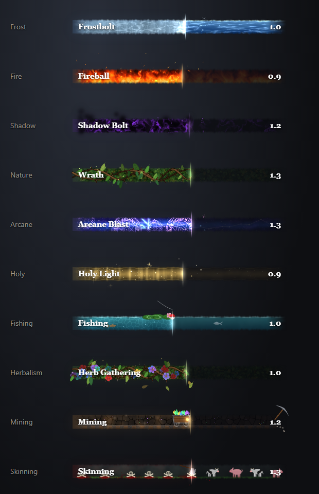

# Dave's WoW Addons

World of Warcraft addons for **WoW: Forever** (Interface 16001), plus the Claude Code tooling used to build them.

## Contents

| Folder | What it is |
| --- | --- |
| [`wowaddons/daves_balls`](wowaddons/daves_balls) | **Dave's Balls**: Diablo-style health and power orbs (v0.1.3) |
| [`wowaddons/daves_sack`](wowaddons/daves_sack) | **Dave's Sack**: an all-in-one bag with categories, search and quality borders (v1.7.8) |
| [`wowaddons/daves_castbar`](wowaddons/daves_castbar) | **Dave's Cast Bar**: an animated elemental cast bar (frost, fire, shadow, nature, arcane, holy), different every cast, plus fishing, herbalism, mining, skinning, smelting and blacksmithing looks (v0.3.0) |
| [`wow-addon-kit`](wow-addon-kit) | Claude Code plugin (`wow-forever-addons`) for scaffolding, testing, reviewing and releasing addons, plus a `HelloForever` example |

## The addons

### Dave's Cast Bar

An animated cast bar that replaces Blizzard's. Each spell gets a look, and every cast is different. There are six elements plus four gathering professions: Fishing, Herbalism, Mining and Skinning are picked automatically from the spell.



```text
/castbar                 options
/castbar test fishing    play a pretend cast of one look (frost, fire, shadow, nature, arcane, holy, fishing, herbalism, mining, skinning, smelting, blacksmithing)
/castbar set frost       right after casting a spell: always give that spell this look (/castbar set auto undoes it)
/castbar unlock          move and resize the bar outside Edit Mode (/castbar lock, /castbar reset)
```

In Edit Mode, drag the bar to move it (it snaps like Blizzard's frames), drag its corner to resize it, and click it for settings. The settings cover size, text size and placement, outline, and a preview of every look. More in [its README](wowaddons/daves_castbar/README.md).

### Dave's Balls

Diablo-style health and power orbs, with swirling liquid that sloshes while you move and glass that catches the light from your cursor.


```text
/balls                   options
/balls unlock            drag the orbs anywhere; right-click one to reset it (/balls lock when done)
/balls reset             put both orbs back
```

In Edit Mode, click an orb for its own settings: liquid and accent colours, number and percent text, and the accent pattern. The orbs can also hide Blizzard's player frame and work like it: left-click targets you, right-click opens your menu. More in [its README](wowaddons/daves_balls/README.md).

### Dave's Sack

One bag window for all your bags, styled like Blizzard's Edit Mode window. Items are sorted into collapsible categories, such as Consumables split into Alchemy, Food & Drink and First Aid, and Reagents split by profession. It has search, sort, quality-coloured slots, backpack currencies and corner resizing.

<!-- Screenshot: add docs/images/daves_sack.png (an in-game capture of the open bag) and uncomment:
 -->

```text
/sack                    open or close the bags
/sack options            settings (also the gear button in the window): columns, scale, categories, start collapsed, extras
```

More in [its notes](wowaddons/daves_sack/NOTES.md).

The cast bar and orb pictures are rendered from the addons' own art (`tools/Show-Preview.ps1`, `tools/Preview-Orb.ps1`), not taken in the game.

## After cloning (or pulling)

Link every addon in `wowaddons/` into the game, so it loads straight from the repo. Run from the repo root; re-run after a pull that adds an addon (existing links are left alone).

Windows (PowerShell, no admin needed; makes junctions):

```powershell
powershell -NoProfile -ExecutionPolicy Bypass -File .\wow-addon-kit\plugins\wow-forever-addons\scripts\Link-WowAddons.ps1
```

Mac (makes symlinks; looks for the game in `/Applications/World of Warcraft`, override with `--wow-root` or `WOW_ROOT`):

```sh
bash wow-addon-kit/plugins/wow-forever-addons/scripts/link-wow-addons.sh
```

Add `-WhatIf` (Windows) or `--dry-run` (Mac) to preview, and `-Remove` / `--remove` to unlink. An existing real folder with the same name is moved to `Interface/AddOns.backup/` first. Then fully restart the game once and enable the addons.

## Installing an addon without the repo

Copy an addon folder from `wowaddons/` into your game's AddOns folder, e.g.:

```
<WoW install>\_forever_\Interface\AddOns\daves_sack
```

## Using the addon kit

```powershell
claude plugin marketplace add ".\wow-addon-kit"
claude plugin install wow-forever-addons@wow-addon-kit
```

See [`wow-addon-kit/README.md`](wow-addon-kit/README.md) for the full list of skills and scripts.
